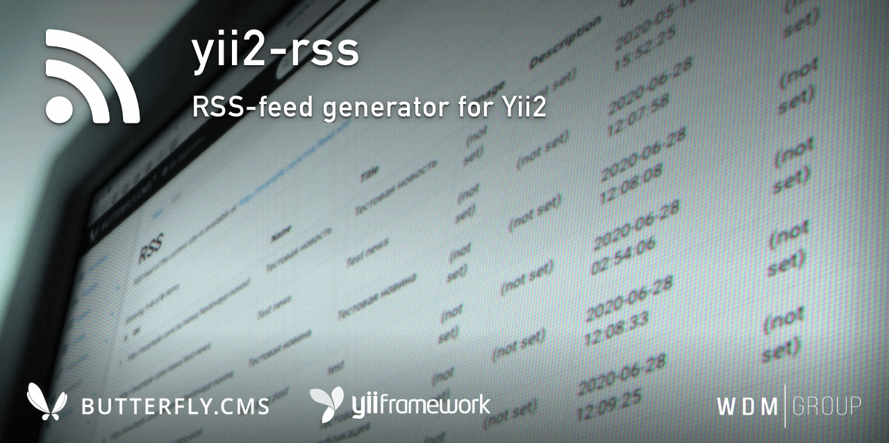

# Yii2 RSS
RSS-feed generator.

This module is an integral part of the [Butterfly.СMS](https://butterflycms.com/) content management system, but can also be used as an standalone extension.

Copyrights (c) 2019-2020 [W.D.M.Group, Ukraine](https://wdmg.com.ua/)

# Requirements 
* PHP 5.6 or higher
* Yii2 v.2.0.35 and newest
* [Yii2 Base](https://github.com/wdmg/yii2-base) module (required)
* [Yii2 Options](https://github.com/wdmg/yii2-options) module (optionality)
* [Yii2 News](https://github.com/wdmg/yii2-news) module (support)
* [Yii2 Blog](https://github.com/wdmg/yii2-blog) module (support)

# Installation
To install the module, run the following command in the console:

`$ composer require "wdmg/yii2-rss"`

After configure db connection, run the following command in the console:

`$ php yii rss/init`

And select the operation you want to perform:
  1) Apply all module migrations
  2) Revert all module migrations
  3) Flush RSS-feed cache

# Migrations
In any case, you can execute the migration and create the initial data, run the following command in the console:

`$ php yii migrate --migrationPath=@vendor/wdmg/yii2-rss/migrations`

# Configure
To add a module to the project, add the following data in your configuration file:

    'modules' => [
        ...
        'rss' => [
            'class' => 'wdmg\rss\Module',
            'supportModels'  => [ // list of supported news models for displaying a news rss-feed
                'news' => 'wdmg\news\models\News',
            ],
            'cacheExpire' => 3600, // cache lifetime, `0` - for not use cache
            'channelOptions' => [], // default channel options
            'feedRoute' => '/' // default route to render RSS-feed (use "/" - for root)
        ],
        ...
    ],

# Routing
Use the `Module::dashboardNavItems()` method of the module to generate a navigation items list for NavBar, like this:

    <?php
        echo Nav::widget([
        'options' => ['class' => 'navbar-nav navbar-right'],
            'label' => 'Modules',
            'items' => [
                Yii::$app->getModule('rss')->dashboardNavItems(),
                ...
            ]
        ]);
    ?>

# Status and version [ready to use]
* v.1.0.4 - Update dependencies, README.md
* v.1.0.3 - Preview of RSS-feed
* v.1.0.2 - Added support for Blog module, fixed models items retrieved
* v.1.0.1 - Added pagination, up to date dependencies
* v.1.0.0 - Added console, migrations and controller, support for Pages and News models